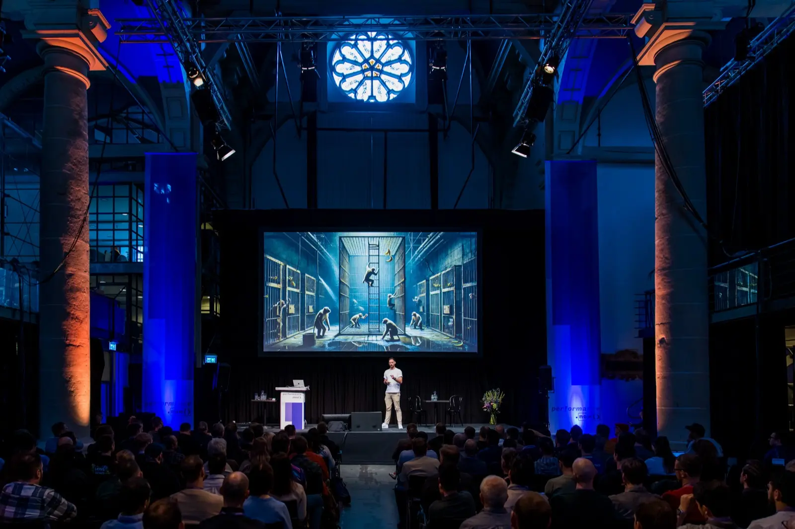

# 👋 Hi, I’m Harry

_— I am co-chair of [performance.now()](https://perfnow.nl/)—_the_ conference
for web performance
professionals_

I am a [Consultant Web Performance Engineer](https://csswizardry.com/) from the
UK. I help some of the world’s largest and most respected organisations find and
fix their site-speed issues.

## 🚦 Availability

I’m currently booking clients for **Q4 2025 and beyond**.

[Get in touch](https://csswizardry.com/contact/) if speed matters to your
business.

## 🛠️ Open Source

I don’t write as much code as I used to, but my biggest or most recent
contributions are:

* 🩺 **[Obs.js](https://github.com/csswizardry/Obs.js):** context-aware web
  performance for everyone.
* 🧼 **[`defaults.css`](https://github.com/csswizardry/defaults.css):**
  a thoroughly modern, light-touch reset for people who like writing CSS.
* 🧠 **[ct.css](https://github.com/csswizardry/ct):** Let’s take a look inside
  your `<head>`.
* 🧊 **[inuitcss](https://github.com/inuitcss/inuitcss):** an extensible,
  scalable, Sass-based, OOCSS framework for large and long-lasting UI projects.

## 🌍 Elsewhere

Find me on:

* 𝕏 [Twitter](https://twitter.com/csswizardry)
* 🦋 [Bluesky](https://bsky.app/profile/csswizardry.com)
* 💼 [LinkedIn](https://www.linkedin.com/in/csswizardry/)
* 📺 [YouTube](https://www.youtube.com/@csswizardry?sub_confirmation=1)
